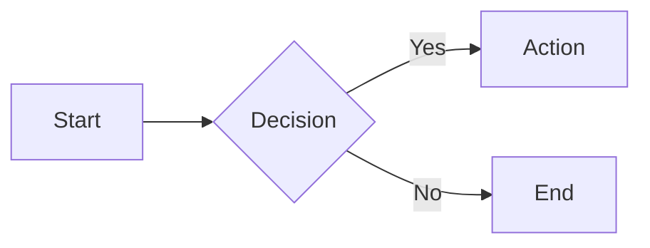
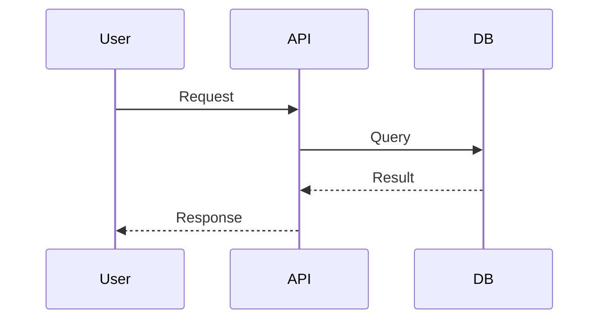
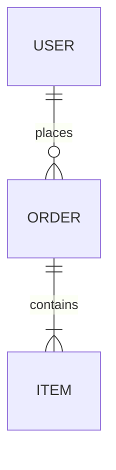

## Principle

Diagrams should **clarify, not complicate**. Start simple, add detail only when needed. A 5-box flowchart beats a 50-node sprawl.

## When User Describes a System or Flow

1. **Identify diagram type** — Is this a flow, architecture, sequence, or data model?
2. **Choose format** — Mermaid (default), PlantUML (complex), ASCII (inline), SVG (custom)
3. **Draft minimal version** — Core elements only, no decoration
4. **Iterate** — Add detail based on feedback

## Diagram Types

| Type | Use For | Format |
|------|---------|--------|
| Flowchart | Processes, decisions, workflows | Mermaid `flowchart` |
| Sequence | API calls, interactions, protocols | Mermaid `sequenceDiagram` |
| Architecture | System components, infrastructure | Mermaid `flowchart` or `C4` |
| ER/Data model | Database schemas, relationships | Mermaid `erDiagram` |
| Class | Object structure, inheritance | Mermaid `classDiagram` |
| State | Lifecycles, status transitions | Mermaid `stateDiagram-v2` |
| Timeline | Project phases, history | Mermaid `timeline` |
| Mindmap | Brainstorming, concept mapping | Mermaid `mindmap` |

## Output Methods

| Method | When |
|--------|------|
| Mermaid code block | User can render (docs, GitHub, Notion) |
| Render to PNG/SVG | User needs image file |
| ASCII inline | Quick sketch in chat |
| HTML + Mermaid.js | Interactive viewing |

### Rendering Mermaid to Image

```bash
# Using mmdc (mermaid-cli)
npx -y @mermaid-js/mermaid-cli mmdc -i diagram.mmd -o diagram.png -b transparent

# Or via browser tool
# Write HTML with Mermaid, screenshot the rendered diagram
```

## Mermaid Quick Reference

**Flowchart:**


**Sequence:**


**ER Diagram:**


## Style Guidelines

- **Left-to-right (LR)** for processes, **top-to-bottom (TB)** for hierarchies
- **Max 10-15 nodes** per diagram, split if larger
- **Consistent naming** — all caps for systems, lowercase for actions
- **Subgraphs** to group related components
- **Color sparingly** — highlight critical paths only

## Common Requests

| Request | Interpret As |
|---------|--------------|
| "Draw my API flow" | Sequence diagram: client → API → services |
| "Show the architecture" | Flowchart with subgraphs for components |
| "Database schema" | ER diagram with relationships |
| "How the auth works" | Sequence or flowchart depending on complexity |
| "User journey" | Flowchart with decision points |

## Anti-Patterns

- ❌ Too many nodes (split into multiple diagrams)
- ❌ Decorative icons without meaning
- ❌ Mixing abstraction levels (database tables next to business concepts)
- ❌ Arrows in all directions (confuses flow)
- ❌ Labels too long (use short names, add legend if needed)
